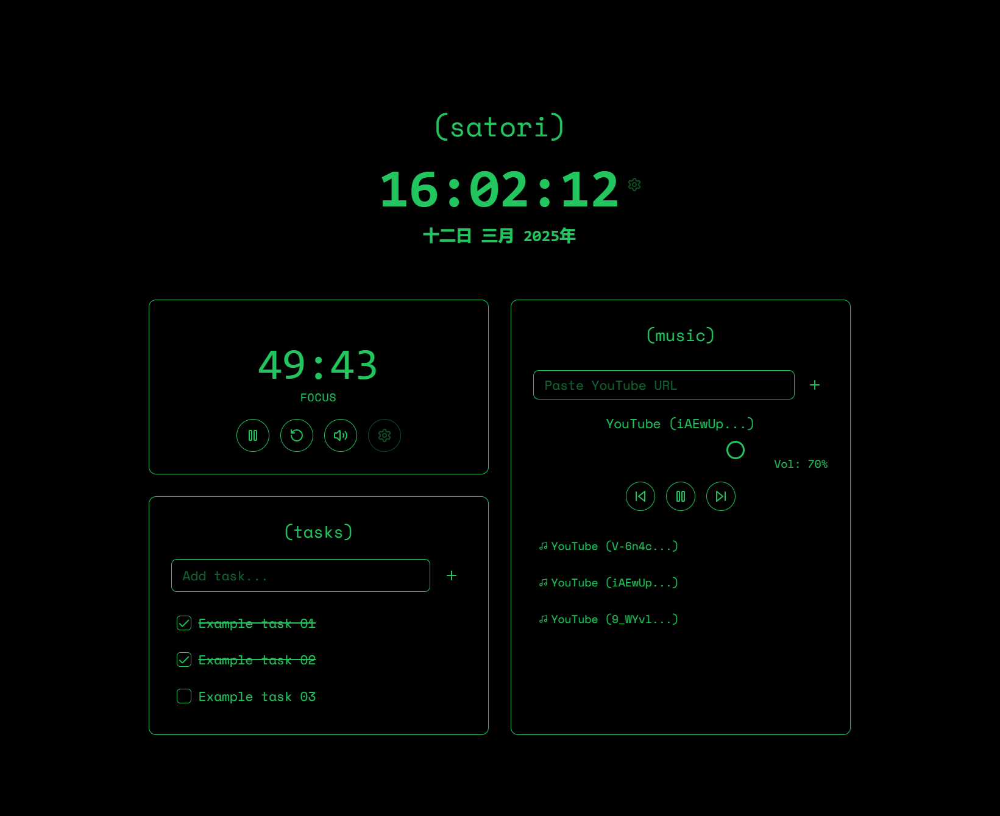

# satori

A modern and intuitive Pomodoro Web Application built with Next.js and TypeScript to help you focus, manage your tasks, and enjoy music while working — all wrapped in a sleek Tokyo-inspired UI. 🌆🈸

## Features ✨

- ⏳ Pomodoro Timer with customizable focus and break intervals
- ✅ Tasks List: Add, complete, and delete tasks effortlessly
- 🎶 Music Player: Add YouTube links to a playlist, auto-play, pause, stop, adjust volume, and manage the queue
- 🌆 Modern Tokyo Vibe UI: Minimalistic, neon-accented design that brings a calm and stylish aesthetic to your workflow
- 🎨 Beautiful and responsive design powered by TailwindCSS and Radix UI components

## Screenshots 🖼️



## Prerequisites 📋

To build and run the project, ensure you have the following installed:

- [Node.js](https://nodejs.org/en) (v18 or newer)
- [npm](https://www.npmjs.com/) (v9 or newer, comes with Node.js)

## Getting Started 🚀

### 1. Clone the Repository

```bash
$ git clone https://github.com/vilsonfcastilho/satori-web.git
$ cd satori-web
```

### 2. Install the dependencies

```bash
$ npm install
```

### 3. Run the application

```bash
$ npm run dev
```

Open `http://localhost:3000` to view it in your browser.

### 4. Build for production

```bash
$ npm run build
$ npm run start
```

## Dependencies 📦

- [`@radix-ui`](https://www.radix-ui.com/) - An open source component library optimized for fast development, easy maintenance, and accessibility.
- [`lucide-react`](https://lucide.dev/guide/packages/lucide-react) - Implementation of the lucide icon library for react applications.

## Contact 📧

For any inquiries or feedback, feel free to reach out via GitHub or email.

---

Made with ♥ by Vilson Castilho
